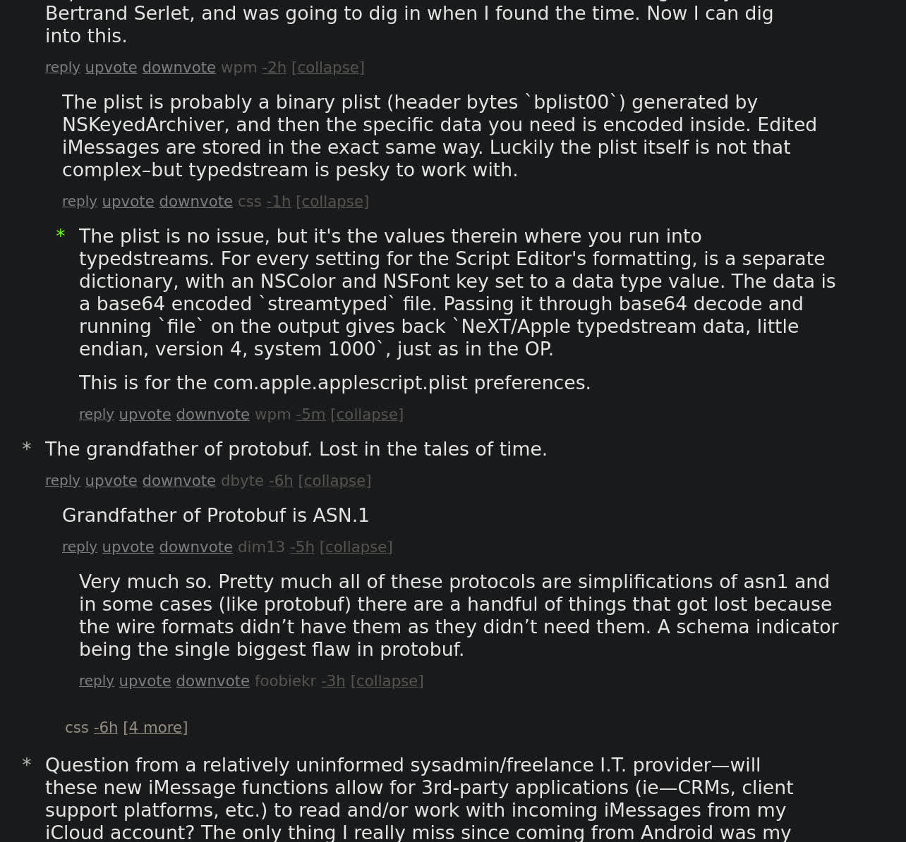

# HN SuperCompact UI

A userscript for ViolentMonkey or TamperMonkey that makes the HN UI even more compact.

Installation:

  - OpenUserJS: [https://openuserjs.org/scripts/hncompact/HN_SuperCompact](https://openuserjs.org/scripts/hncompact/HN_SuperCompact)
  - GreasyFork: [https://greasyfork.org/en/scripts/525818-hn-supercompact-ui](https://greasyfork.org/en/scripts/525818-hn-supercompact-ui)
  - From source: [hncompact.user.js](hncompact.user.js)

## The Front Page

## The Comments Page

